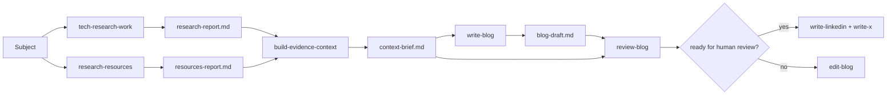

# Architecture

Phase 1 keeps orchestration, evidence, writing, and review separate. Codex supplies runtime judgment; the repository supplies repeatable contracts.

## Design boundaries

- Skills have one focused responsibility and a Markdown output contract.
- `create-content` coordinates existing skills; it does not duplicate their logic.
- Research labels verified evidence, interpretation, and unknowns.
- `review-blog` is a quality gate, not proof of correctness.
- Social skills transform the reviewed canonical article instead of reconstructing it.
- Human review remains required before publication.

The repository intentionally does not introduce LangChain, LangGraph, RAG, a vector database, queues, publishing APIs, or custom runtime infrastructure.
